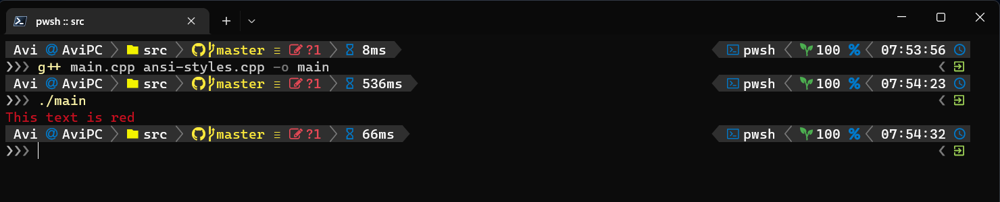
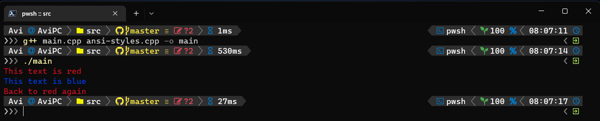

# Ansi Styles

## What

Ansi styles is a c++ utility for ansi escape sequences,
ansi escape sequences are used to control appearance of text in terminal emulators that support it, it can control the clolor of the text and the background color.

## How to use it

1. include `ansi-styles.hpp`,
2. use the namespace `ansi_styles`,
3. create a `ResetPoint` object,
4. set the property you want with one of the builtin functions.

here is an example:
```cpp
#include "ansi-styles.hpp"
#include <iostream>
using namespace ansi_styles;

int main()
{
    ResetPoint reset;
    color(RED);
    std::cout << "This text is red" << std::endl;
}
```



## Auto resetting

- the constructor of the object memorizes the style at that moment,
- when the object goes out of scope the destructor resets the style to the time of the creation.

here is an example:
```c++
int main()
{
    ResetPoint reset1;
    color(RED);
    std::cout << "This text is red" << std::endl;
    {
        ResetPoint reset2;
        color(BLUE);
        std::cout << "This text is blue" << std::endl;
    }
    std::cout << "Back to red again" << std::endl;
}
```



## Available methods and fuctions

- there are 3 variants of the `color()` function:
  - `color(Color color)` that receives `enum Color`,
  - `color(unsigned char bit8_code`) that receives a number between 0 - 255,
  - `set_color(unsigned chat r, unsigned char g, unsigned char b)` that receives RGB values.
- a method `color()` that resets the color to time of creation of the object.
- there are 3 variants of the `background()` function, same as the above but for the background,
- a method `background()` that resets the background,
- a method `reset()` that resets both color and background.

## The type `enum Color`

Theses are the builtin colors:
- `DEFAULT` the system default,
- `BLACK`,
- `RED`,
- `GREEN`,
- `YELLOW`,
- `BLUE`,
- `MAGENTA`,
- `CYAN`,
- `WHITE`,
- `BRIGHT_BLACK`,
- `BRIGHT_RED`,
- `BRIGHT_GREEN`,
- `BRIGHT_YELLOW`,
- `BRIGHT_BLUE`,
- `BRIGHT_MAGENTA`,
- `BRIGHT_CYAN`,
- `BRIGHT_WHITE`.